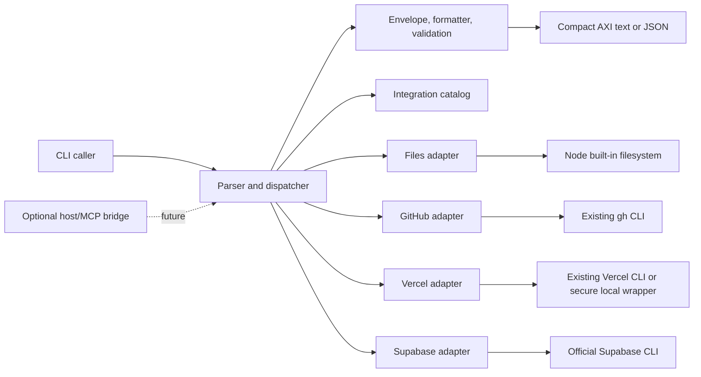

# Architecture

`suazo-axi` separates parsing and presentation from transport-specific behavior. The core owns stable contracts; adapters inherit authentication from already configured tools.

## Contracts

The envelope is stable and versioned by its `axi` field. Defaults are deliberately small, aggregates such as `total` and `returned` are precomputed only when supported by the response already in hand, and every collection reports `empty`. A limited provider page reports `totalKnown: false` instead of presenting its returned size as a global total. `help` supplies contextual next actions. Full JSON Schemas live in `schemas/`.

The compact formatter is an AXI compact subset. It is deterministic and content-first; JSON is the lossless machine format. The formatter is isolated so a conforming official TOON encoder can be introduced without changing adapters.

## Adapter interface and manifest

An adapter exports narrowly scoped functions that accept validated values and return `{ data, meta }`. It must not write to stdout, read credentials directly, or expose raw provider output. Provider adapters normalize JSON before returning it. A service manifest declares `id`, `domain`, `transport`, `phase`, `status`, and read/mutation capabilities; its schema is `schemas/service-manifest.schema.json`.

Extension order is explicit: prefer a native implementation or an existing CLI, then use an MCP/API/native connector bridge only where necessary. Optional `gh-axi` and `chrome-devtools-axi` backends may be preferred when present in a future release. Phase 1 neither installs nor assumes them.

## Threat model

The main risks are path traversal, symlink escape, command injection, unbounded output, hung child processes, secret leakage, and accidental mutation. Files resolve against a real explicit root, re-check opened paths, compare stable file identities where available, and reject outside paths. Default reads consume a bounded byte window; `--full` is deliberately unbounded. Children use `shell: false`, fixed argument arrays, timeouts, byte caps, ignored stdin, isolated POSIX process groups, bounded graceful/forced tree termination, and hidden Windows windows. Errors retain codes but discard provider stderr so tokens and account details cannot leak. Searches skip `.git`, `node_modules`, `.codex`, `.firecrawl`, and `graphify-out`.

The broker does not defend against a malicious binary already installed under a trusted command name, an operator granting an inherited tool excessive authority, or a malicious local process that can continuously rewrite the allowed filesystem tree during access. Node cannot provide a portable `openat`/directory-handle identity guarantee across Windows and POSIX; the implementation narrows and detects common reparse races but treats a concurrently hostile root as outside its trust boundary. Trust and scope remain properties of the host environment.

`doctor` separates executable presence from authentication. Planned CLI presence is resolved from `PATH` and, on Windows, `PATHEXT` without executing the command. GitHub and Vercel have safe authenticated probes that discard provider output; probe failures degrade that diagnostic rather than aborting the full doctor result.

## Mutations and optional MCP facade

Read operations are the default. A future mutation must require `--apply`, expose a plan before apply, and accept an idempotency key. A one-tool MCP facade is optional because the CLI contract is already portable and inspectable; making MCP the default would add a host dependency, hide normal process semantics, and reduce usefulness in terminals and scripts. A facade can translate the same envelope later without becoming the architecture.

## Observability

Observe command name, adapter, duration, exit category, truncation, counts, and correlation identifiers. Do not log file contents, provider payloads, arguments likely to contain content, credentials, or environment values. Metrics should remain useful even when content logging is disabled.
